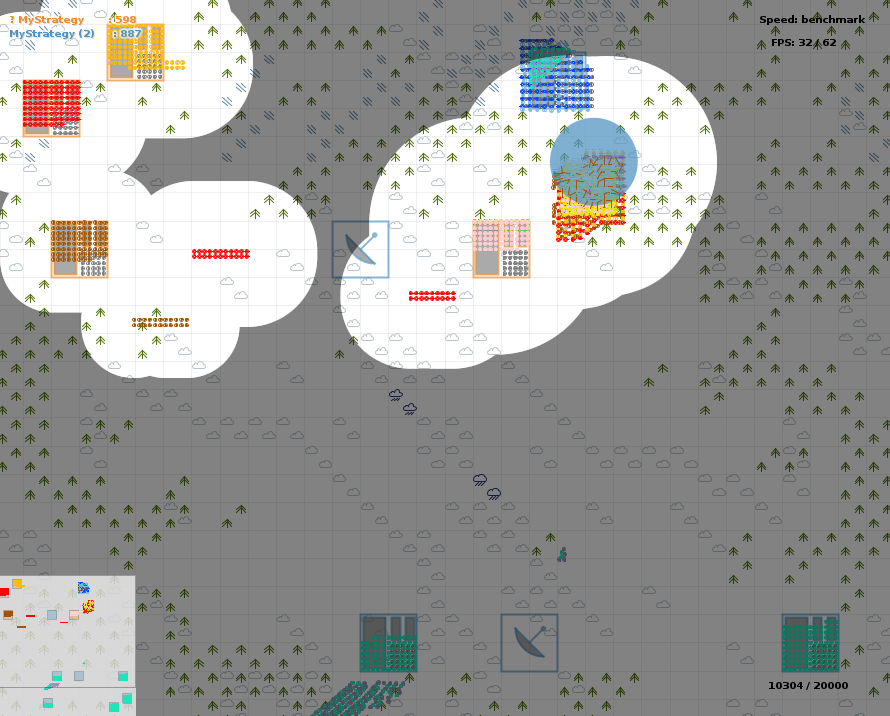

# CodeWars 2017

Franz Cesista's finals-qualifying strategy for the Russian AI Cup 2017 CodeWars competition.



## Game Mechanics

CodeWars is a Command-and-Conquer-esque game where we and our enemy have hundreds of units of different types. The unit types are kind-of like rock-paper-and-scissor: a unit type can easily beat some types while weak to other types. Each enemy kill is worth 1 point and our goal is to either (a) kill all enemy units or (b) get a higher score than our opponent when the timer runs out.

In the later stages, fog-of-war gets activated and Facilities appear on the map. Capturing them gives us 50 points and holding them long enough gives us new units that'd spawn near the Facilities. We could also launch nukes from time to time.

Finally, we are only allowed to do at most 60 actions per second.

## Techniques Used in My Strategy

### 1) K-Means Clustering

The 60 actions-per-second rule makes it infeasible to manage our forces with precise granularity. And thus, we need to divide them into "army groups" that behave as if they're a single unit. Most of our opponents do this too, but they don't (and can't) tell us which units belong to which groups. And so, we have to guess the groupings with K-means clustering.

### 2) State-Space Breadth-First Search

After grouping our units, we then do a state-space search using BFS to find the optimal initial positions before launching our offensives. Note: we only use BFS to rearrange our army groups, not to find the perfect attack paths for them.

### 3) Potential Flows

Finally, even with the groupings, it's impossible to make a strategy that takes into account all possible permutations of allied & enemy positions. Thus, we need to rely on heuristics. One such heuristic is by modelling the stuff in the game map as particles that produce potential fields. All of our army groups (and stronger enemy groups) are negatively charged - thus, they repel each other. While our targets (facilities & weaker enemy groups) attract each other. We calculate this potential field for each group. And viola, we now have a direction field for our units.


## How to Run

### Clone the repository

First, clone the repository by running

```bash
git clone https://github.com/leloykun/codewars-2017.git
```

Then go to the folder

```bash
cd codewars-2017
```

### Install requirements

> Note: the simulators work best on Linux. You can run them on Windows, but you'll need to install the [Windows Subsystem for Linux](https://docs.microsoft.com/en-us/windows/wsl/install) first.

Install python library and linux system requirements by running

```bash
./install_requirements.sh
```

You may need to give user permission to execute the script by running

```bash
chmod +x install_requirements.sh
```

### Configuration

You can enable or disable `facilities`, `fog-of-war`, and toggle various other options by editing the `local-runner.default.properties` file in `local-runner-en`.

If you want to play the game yourself, set `p1-type=Keyboard`.

If you want to play against a simpler enemy, set `p2-type=Quick`.

And if you want to just practice moving the units, set `p2-type=Empty`

### Running the simulation

In one terminal, run the local runner server:

```bash
cd local-runner-en
./local-runner.sh
```

You may need to give user permission to execute the script by running

```bash
chmod +x ./local-runner.sh
```

And in a second terminal, run the first strategy:

```bash
cd strategies/python3-cgdk
python3 Runner_v29.py
```

And in a third terminal, run the second strategy:

```bash
cd strategies/submitted_strat
python3 Runner.py 127.0.0.1 31002 00000000000
```

## Building Your Own Bot

First, read the [Documentation](docs/codewars_2017_docs_1_2_2.pdf). The Documentation contains the rules of the game and guidelines on the strategy you need to implement.

### C++

Unzip the contents of `zips/cpp-cgdk.zip` into a folder of your choice. This folder will be referred to as `<cpp-cgdk>`. Then modify the contents of `cpp-cgdk/MyStrategy.cpp` to implement your strategy.

### Python

Unzip the contents of `zips/python3-cgdk.zip` into a folder of your choice. This folder will be referred to as `<python3-cgdk>`. Then modify the contents of `python3-cgdk/MyStrategy.py` to implement your strategy.

### Testing

Follow the `Running the simulation` section above but run your own strategy in the last step.

```bash
cd strategies/my_strategy
python3 Runner.py 127.0.0.1 31002 00000000000
```

## FAQ

- Why does the GUI in WSL2 just display a blank canvas?
  - You need to restart your WSL2. Try running `wsl --shutdown` then `wsl`
- Can I share my own bot? If so, how?
  - Yes, of course! Just copy the folder of your strategy to `strategies/` and rename it to `[your last name here]_v[version number]`.

## How to Contribute

1. Fork this repository.
2. Clone this repository into your local machine.
3. Add and commit your changes to the repository. And don't forget to add your name to the Contributors section below.
4. Submit a Pull Request and tag one of the contributors to review your code.
5. Wait for the review and address the reviewer's comments if necessary.
6. Wait for the reviewer to approve your PR.
7. Merge your PR.

## Contributors

### Main Contributor

- [Franz Louis Cesista](https://github.com/leloykun), ML SWE at [Expedock](https://github.com/expedock), 2x IOI & ICPC World Finalist.
